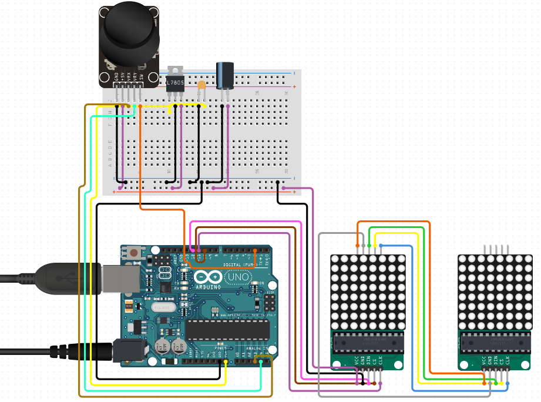

# snakegame :snake:

# Parts :balloon:
Part Name            |       Ebay Link        |         Price | Note
:------------------- | ---------------------- | ------------: | :------------------------------------------------
Arduino Uno          | [Arduino UNO](https://ardushop.ro/ro/home/29-placa-de-dezvoltare-uno-r3.html?search_query=arduino+una&results=208) |  **27,04 lei** | Or [Arduino MEGA](https://ardushop.ro/ro/electronica/71-placa-de-dezvoltare-mega-2560-arduino-compatibil.html?search_query=arduino+mega&results=174)
LED Matrix           | [Led Matrix](https://ardushop.ro/ro/home/409-matrice-led-uri-8x8-circuit-de-control.html?search_query=matrice+leduri&results=33) |  **15,89 lei** | MAX7219 controlled 8x8 LED Matrix or [Led Matrix](https://ardushop.ro/ro/home/95-matrice-led-uri-8x8-circuit-de-control.html?search_query=matrice+leduri&results=33)
LED Matrix           | [Led Matrix](https://ardushop.ro/ro/home/409-matrice-led-uri-8x8-circuit-de-control.html?search_query=matrice+leduri&results=33) |  **15,89 lei** | We need 2x Led Matrix
Joystick             | [Joystick](https://ardushop.ro/ro/electronica/127-modul-joystick.html?search_query=Joystick&results=3) |  **9,91 lei** | 
Some wires           | [Wires](https://ardushop.ro/ro/electronica/291-10-x-fire-dupont-mama-tata-20cm.html) |  **3,44 lei** | 12 wires needed
Breadboard           | [Breadboard](https://ardushop.ro/ro/electronica/33-breadboard-830.html?search_query=breadboard&results=15) |  **18,96 lei** | 
USB A-B 1m           | [USB A-B](https://ardushop.ro/ro/electronica/73-cablu-usb-a-b-18m-arduino-mega-uno-imprimanta.html) |  **5,94 lei** | 
**Total**            |                        | **97.07‬ lei** | 

# Tutorial :loudspeaker:
1. Get the parts, install [Arduino IDE](https://www.arduino.cc/en/Main/Software), install drivers for Arduino
2. Install the `LedControl` library using Arduino IDE [Library Manager](https://www.arduino.cc/en/Guide/Libraries#toc2)
3. Copy-paste [the code](https://github.com/moldovanpaul75/snakegame) into Arduino IDE
4. Wire everything up _(see the Wiring Diagram)_
5. Connect your Arduino and select it in `Tools > Board` and `Tools > Port`
6. Upload the code
7. _(optional)_ Tweak the variables, explore the code :wink:

# Circuit Diagram

# Wiring diagram :tada:
Pin           | Arduino NANO or UNO
:------------ | :------------------
Matrix CLK    | 11
Matrix CS     | 10
Matrix DIN    | 9
Joystick VRx    | A0
Joystick VRy    | A1
Joystick SW    | 2
